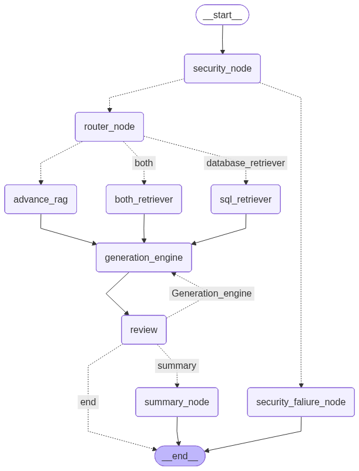

# Enterprise Customer Support AI Engine

A production-grade, stateful conversational AI assistant built using **LangGraph**, **FastAPI**, and **LangChain**. The system features an intelligent cognitive routing mechanism that dynamically orchestrates context retrieval across a relational SQLite database and a high-density Chroma vector database (RAG).

## 🏗️ System Architecture

The core of this application is an advanced agentic state machine that manages long-term conversations, self-corrects its output, and optimizes memory token usage.

### Key Architectural Features:
* **Dynamic Cognitive Routing:** Analyzes incoming user intents using structured LLM outputs to determine if a query requires policy lookups (RAG), customer account lookups (SQL), or both.
* **Self-Healing Validation Loop:** A dedicated verification node inspects the generated output against policy constraints. If a violation or hallucination is detected, it generates a critique feedback hint and triggers an automatic retry loop up to 8 times.
* **Token-Efficient Memory Management:** When active chat history hits predefined conversation thresholds, a summary node automatically compresses historical turns into a clean running context summary and safely removes older raw message IDs using LangGraph's state checkpointers.
* **Asynchronous API Gateway:** Wrapped entirely in a robust FastAPI application utilizing `SqliteSaver` database checkpointers to ensure isolated, multi-threaded conversation session tracking via persistent `thread_id` keys.

## System Architecture

## Core Features
* **Asymmetric Input Guardrails (`security_node`):** Intercepts user queries at the `START` node using an LLM configured with structured Pydantic outputs to detect and short-circuit malicious prompt injections or out-of-bounds requests before hitting core infrastructure.
* **Dynamic Supervisory Router (`router_node`):** Classifies user intent to route processing dynamically to an Advanced RAG pipeline, a SQL Database retriever, or a dual orchestrator branch depending on context requirements.
* **Deterministic Quality Loops (`review` node):** Validates generated agent responses against retrieved policy context constraints, initiating an auto-correction regeneration loop if compliance flags are raised.
* **Context Summary Engine (`summary_node`):** Triggers a rolling conversational window truncation strategy every 8 turns using `RemoveMessage` to maintain minimal token footprints while persisting essential conversation state (Order IDs, Names, Issues).

---

## 📁 Project Structure

* `agent_code.py` — Core LangGraph orchestration brain, state definitions, node logic, and routing conditions.
* `app.py` — FastAPI wrapper exposed with strict Pydantic payload models and session tracking endpoints.
* `frontend.py` — Interface application script built to interact directly with the FastAPI backend engine.
* `requirements.txt` — Tracked external framework dependencies and pinned package versions.
* `user_data.db` — Local relational database managing customer orders, statuses, and profiles.
* `chroma_db/` — Vector embedding database storage holding segmented corporate policy data.
